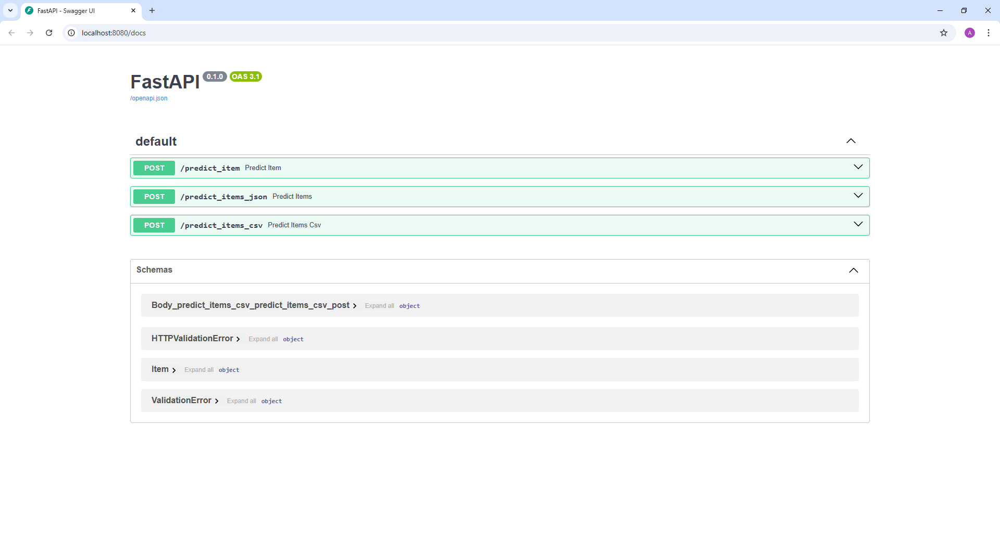
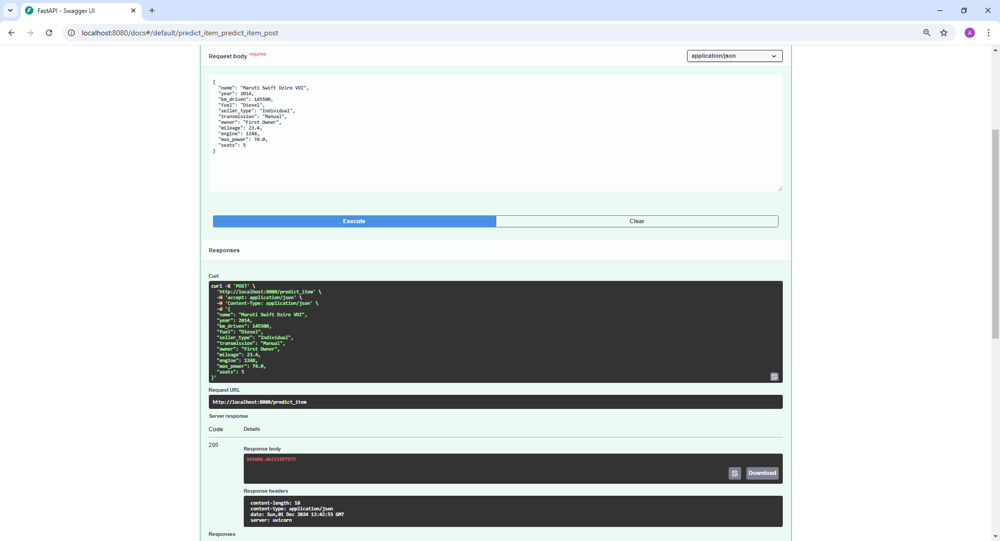
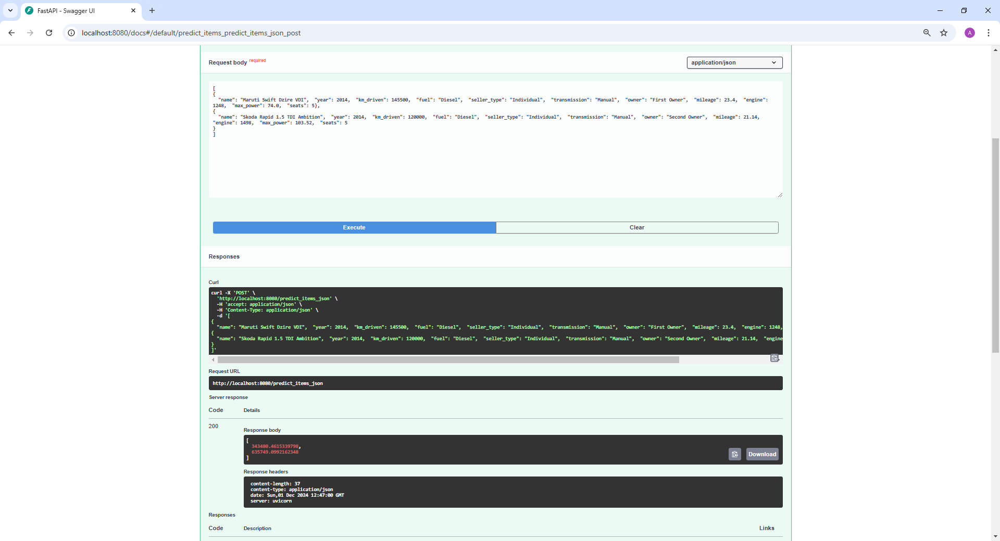
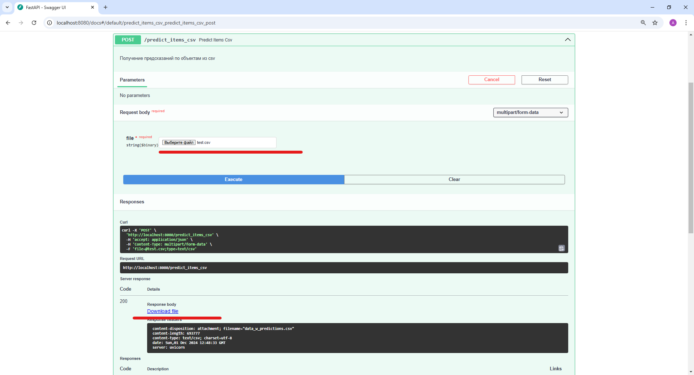
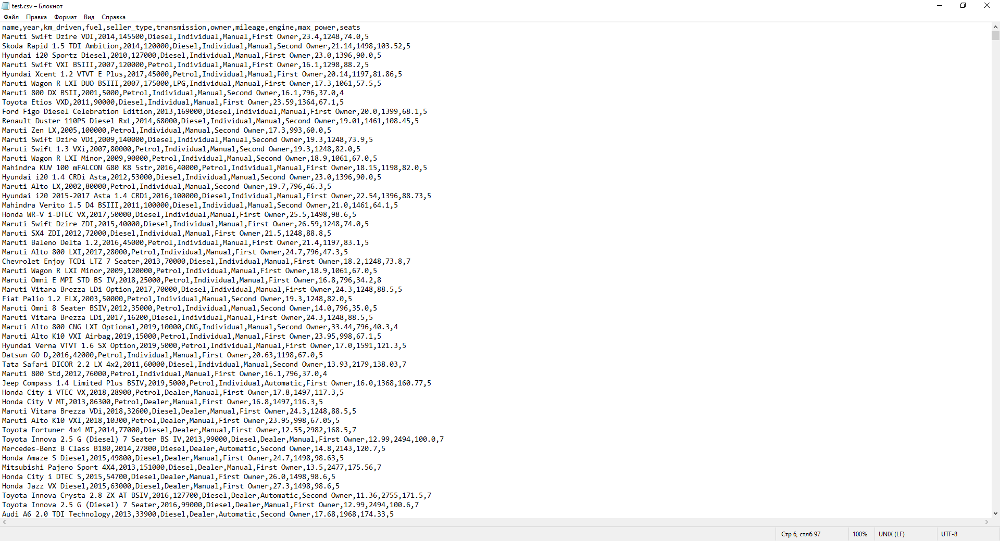
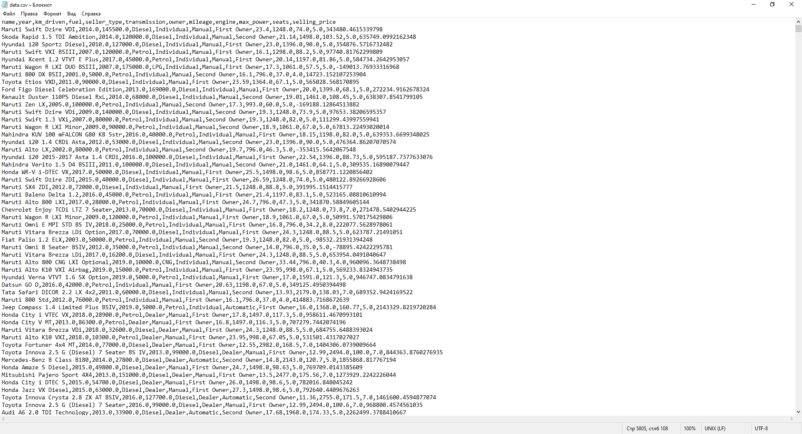

# Что было сделано

## EDA

### Предобработка
1. Удалили дубликаты
2. Извлекли из текстовых данных числовые признаки (столбцы `mileage`, `engine`, `max_power`)
3. Заполнили пропуски в числовых столбцах при помощи медианы (этот шаг также был включен в итоговый пайплайн)

### Визуализация
1. Рассмотрели попарные распределения признаков на тренировочных и тестовых данных
- Выдвинули гипотезы о зависимости значений целевой переменной `selling_price` от признаков `engine` и `max_power`, а также между парами признаков `max_power`-`engine` и `engine`-`mileage`
- Сделали вывод о схожести распределений между тренировочным и тестовым набором, что дает право говорить о репрезантативности результатов, полученных в будущем при обучении моделей
2. Рассмотрели корреляцию Пирсона и $\phi_k$
- Корреляции не опровергли предыдущие предположения, сделанные на основе вида распределений, а также выявили потенциальную зависимость между целевой переменной и категориальными признаками `transmission` и `owner`

## Обучение моделей

1. Обучили стандартную линейную регрессию без и с стандартизацией признаков
- Получили значение метрики $R^2=0.59$
- Стандартизация, ожидаемо, не изменила результат
- Наибольший вклад в модель, исходя из весов, дает признак `max_power`, что в целом имеет смысл
2. Обучили линейные регрессии с регуляризацией: `Lasso` и `ElasticNet`
- Гиперпараметры подбирали на кросс-валидации с 10-ю фолдами
- Принципиально улучшить качество модели не удалось, однако удалось его сохранить при уменьшении размерности признакового пространства ($L_1$-регуляризация занулила веса при признаках `mileage`, `engine` и `seats`)
3. Добавили в модель категориальные признаки и обучили `Ridge` регрессию
- Из названия авто выделили марку и закодировали при помощи `TargetEncoder`'а
- Переменную `seats` закодировали при помощи `OHE`
- Это подход, ожидаемо, дал значительно улучшение в качестве модели по метрике `R^2`
4. Сравнили обученные модели по кастомной метрике: доля прогнозов модели, отличающихся от истинного значения не более чем на 10%
- Все модели показали практически одинаковое качество в рамках этой метрики

## FastAPI inference

### Общее
1. Для инференса предполагаем, что данные в модель подаются в том формате, в котором они у нас были перед началом этапа обучения моделей (то есть в столбцах `mileage`, `engine`, `max_power` содержатся числа) за исключением того, что мы допускаем наличие пропусков
2. Собираем паплайн из лучшей модели: `Ridge` регрессия + закодированные категориальные признаки (извлечения марки авто из столбца `name` для последующего кодирования также на стороне модели). Обучаем с лучшим подобранным ранее гиперпараметром регуляризаци и сериализуем при помощи `cloudpickle` (мотивация - наличие `lambda`-фукнции в одном из трансформеров) для последующего использования в сервисе
3. Исполняемый код сервиса находится в папке `fastapi_app`, там же хранится сериализованная модель

### Демонстрация работы
- Реализованы 3 ручки для получения предсказаний 

1. `/predict_item`: получение предсказания для одного объекта

2. `/predict_items_json`: получение предсказаний для списка объектов

3. `/predict_items_csv`: получение предсказаний по объектам из csv

- Пример input файла:

- Пример output файла:

